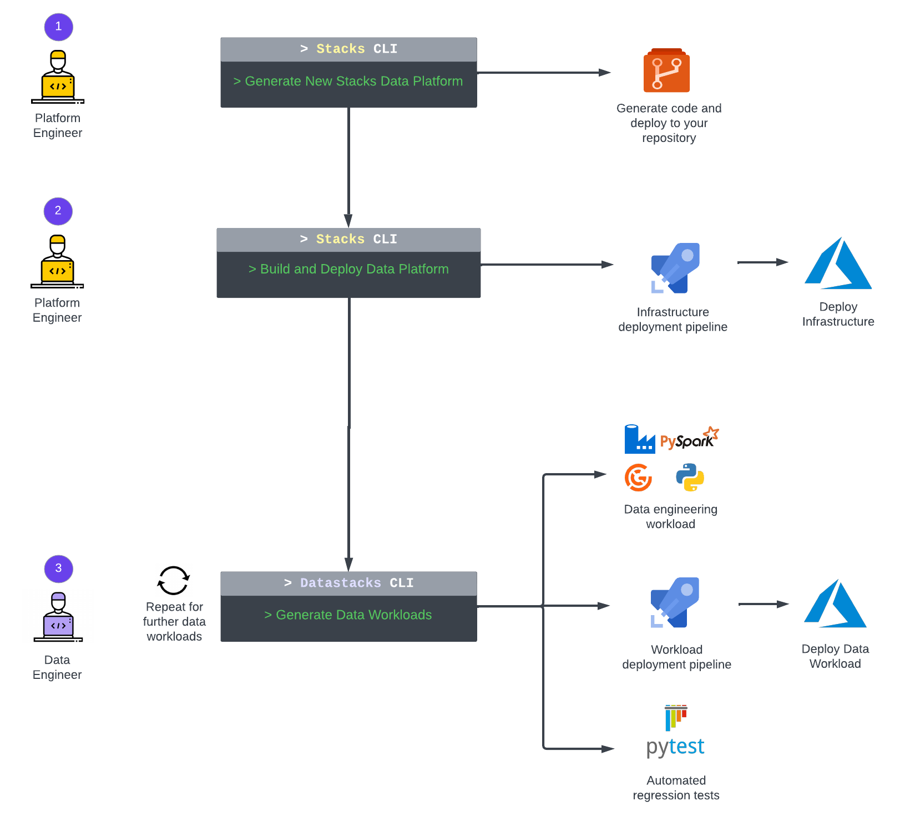
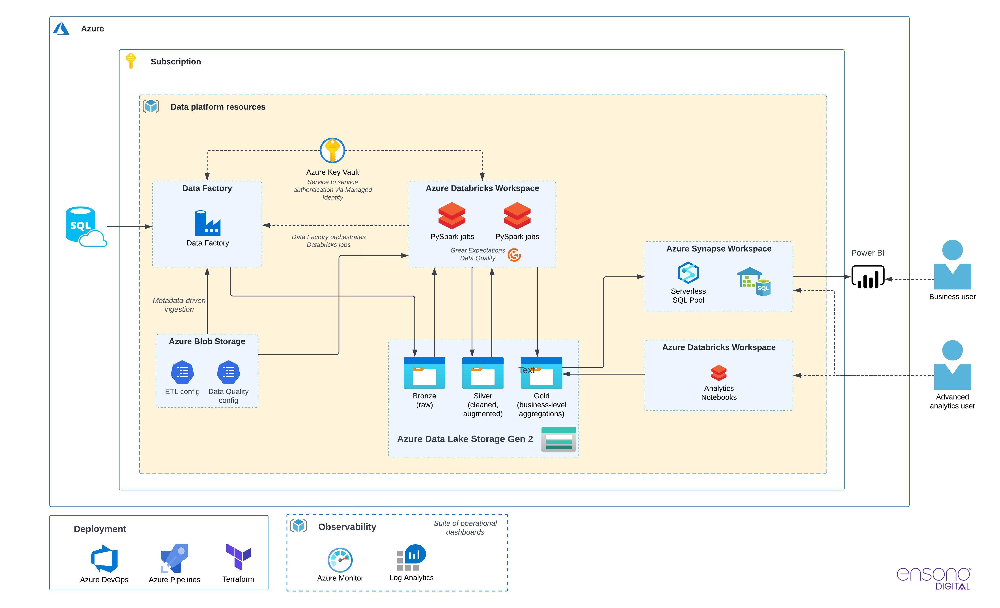

# Stacks Azure Data Platform

Link to the official documentation:
[Stacks Azure Data Platform](https://stacks.ensono.com/docs/workloads/azure/data/intro_data_azure).

## Overview

The Ensono Stacks Azure Data Platform solution provides a framework for accelerating the deployment of a production-ready modern data platform in Azure.



1. Use the [Ensono Stacks CLI](https://stacks.ensono.com/docs/stackscli/about) to generate a new data platform project.
2. Build and deploy the data platform infrastructure into your Azure environment.
3. Accelerate development of data workloads and ELT pipelines with the [Datastacks CLI](https://stacks.ensono.com/docs/workloads/azure/data/data_engineering/datastacks.md).

The Ensono Stacks Data Platform delivers a modern _Lakehouse_ solution, based upon the [medallion architecture](https://stacks.ensono.com/docs/workloads/azure/data/data_engineering/data_engineering_intro_azure.md#medallion-architecture), with Bronze, Silver and Gold layers for various stages of data preparation. The platform utilises tools including **Azure Data Factory** for data ingestion and orchestration, **Databricks** for data processing and **Azure Data Lake Storage Gen2** for data lake storage. It provides a foundation for data analytics and reporting through **Microsoft Fabric** and **Power BI**.

Key elements of the solution include:

- Infrastructure as code (IaC) for all infrastructure components (Terraform).
- Deployment pipelines to enable CI/CD and DataOps for the platform and all data workloads.
- Sample [data ingest pipelines](https://stacks.ensono.com/docs/workloads/azure/data/data_engineering/ingest_data_azure.md) that transfer data from a source into the landing (Bronze) data lake zone.
- Sample [data processing pipelines](https://stacks.ensono.com/docs/workloads/azure/data/data_engineering/data_processing.md) performing data transformations from Bronze to Silver and Silver to Gold layers.

The solution utilises the [Stacks Data Python library](https://stacks.ensono.com/docs/workloads/azure/data/data_engineering/stacks_data_utilities.md), which offers a suite of utilities to support:

- Data transformations using PySpark.
- Frameworks for [data quality validations](https://stacks.ensono.com/docs/workloads/azure/data/data_engineering/data_quality_azure.md) and [automated testing](https://stacks.ensono.com/docs/workloads/azure/data/data_engineering/testing_data_azure.md).
- The [Datastacks CLI](https://stacks.ensono.com/docs/workloads/azure/data/data_engineering/datastacks.md) - a tool enabling developers to quickly generate new data workloads.

### High-level architecture



## Repository structure

```md
stacks-azure-data
├── build           # Deployment pipeline configuration for building and deploying the core infrastructure
├── de_build        # Deployment pipeline configuration for building and deploying data engineering resources
├── de_workloads    # Data engineering workload resources, including data pipelines, tests and deployment configuration
│   ├── generate_examples    # Example config files for generating data engineering workloads using Datastacks
│   ├── ingest               # Data ingestion workloads
│   ├── processing           # Data processing and transformation workloads
│   ├── shared_resources     # Shared resources used across data engineering workloads
├── deploy          # TF modules to deploy core Azure resources (used by `build` directory)
├── docs            # Documentation
├── stacks-cli      # Example config to use when scaffolding a project using stacks-cli
├── utils           # Python utilities package used across solution for local testing
├── .pre-commit-config.yaml         # Configuration for pre-commit hooks
├── Makefile        # Includes commands for environment setup
├── pyproject.toml  # Project dependencies
├── README.md       # This file
├── stackscli.yml   # Tells the Stacks CLI what operations to perform when the project is scaffolded
├── taskctl.yaml    # Controls the independent runner
└── yamllint.conf   # Linter configuration for YAML files used by the independent runner
```

### Terraform Locals

In the directories, `deploy/azure/infra` and `deploy/azure/networking` there is a `locals.tf` file. This file is used to calculate values based on given variable values and / or whether to get the values from a data block.

Additionally it is used to store complicated object variables that have been traditionally stored in the `vars.tf` file. For example the `network_details` in the `deploy/azure/networking/locals.tf` describes all of the networking information required to establish the hub and spoke network.

As the details are stored in the locals file they cannot be overridden using variables, so this will need to be updated with respect to specific network requirements, if the defaults do not work.

## Developing the solution

Please refer to the documentation for getting started with developing Stacks:
[Local Development Quickstart](https://stacks.ensono.com/docs/workloads/azure/data/getting_started/dev_quickstart_data_azure).
