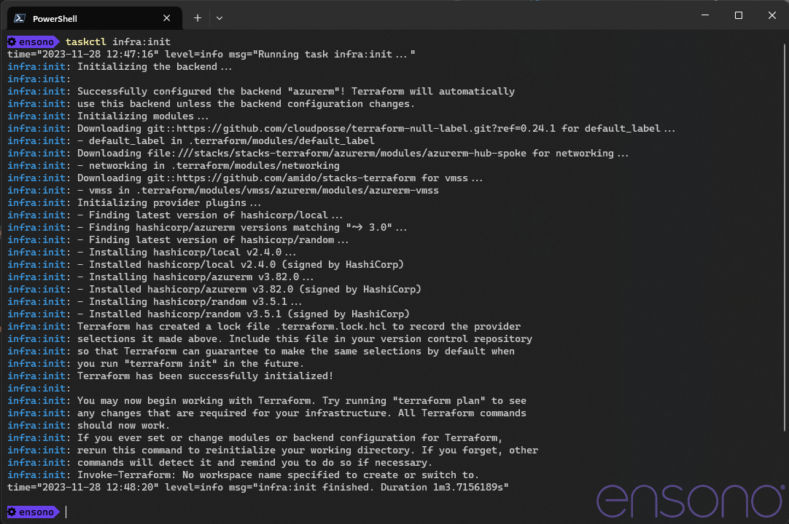
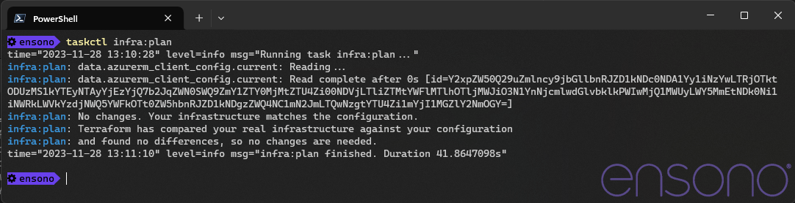
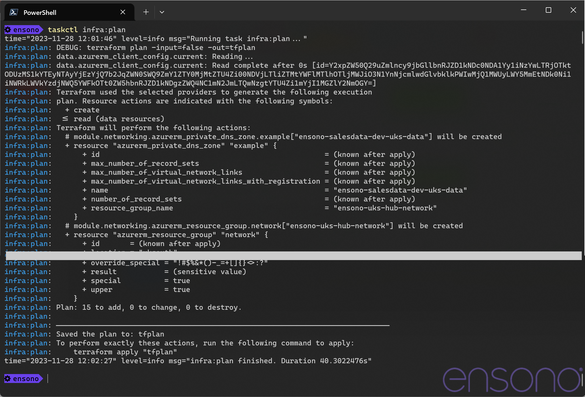

== Infrastructure Deployment

The infrastructure for this project is deployed using the Ensono Independent Runner (EIR), this means that the same commands can be run locally as would be run in the formal CI/CD pipeline.

The Terraform templates in this repository create any required networks as well as the components for a data environment. The network is intended to be run once and the environment components run numerous times to connect to the deployed network.

=== Deployment from local workstation

==== Tools

In order to use EIR locally two tools are required.

* Taskctl - https://github.com/Ensono/taskctl/releases/tag/v1.5.1
** Please ensure you download this version of Taskctl as it is has support for generating the environment file required for the container
* Container Engine (any one of the following will work)
** Docker Desktop - https://www.docker.com/products/docker-desktop/
** Rancher Desktop - https://rancherdesktop.io/
** Podman - https://podman.io/

With these tools installed all of the tasks in EIR can be run locally.

==== Setup

There are a number of variables that need to be configured in order to deploy any of the terraform templates. To make this easier EIR contains a task that will create a shell script (PowerShell or Bash, depending on what is being run) that will configure th required environment variables. Once this file has been generated it must be edited to suit the environment.

When the script file has been updated, run it and then subsequent tasks can be executed. All of the environment variables in the current shell will be copied into the execution environment.

NOTE: The following provides an example of deploying the network stage of the Terraform files. The same process is true for the infra stage.

IMPORTANT: If the repo directory does not have a `local` subfolder, create it. This folder is ignored by Git so files will be not be checked in. The directory is used to save generated script files.

[source,powershell,linenums]
----
# Create a script to setup the environment variables for networking infrastructure
$env:CLOUD_PLATFORM = "azure"
$env:STAGE = "networking"
taskctl setup:dev
----

.Create script to configure environment variables
image::images/create-env-script.png[]

The setting of the CLOUD_PROVIDER variable informs the script which environment variables are required for the chosen provider. These will be added to the script and should be updated accordingly:

[cols="1a,1a",options=header]
|====
| Azure | AWS
| * ARM_CLIENT_ID
* ARM_CLIENT_SECRET
* ARM_SUBSCRIPTION_ID
* ARM_TENANT_ID
| * AWS_ACCESS_KEY_ID
* AWS_SECRET_ACCESS_KEY
* AWS_REGION
|====

NOTE: If there are concerns about adding such values to a file they can be set before the generation of the script, as they have values they will not be added to the file.

Once the file has been created, it needs to be edited with the relevant values. The following shows example values in the file.

.Setting envrionment variables
[source,powershell,options=linenums]
----
# The Cloud platform for which these variables are being set
$env:CLOUD_PLATFORM="azure"

# Path to the Terraform template files, from the perspective of the executing container
$env:TF_FILE_LOCATION="/app/deploy/azure/networking"

# 
$env:ARM_CLIENT_ID="d819a784-70ca-4eb2-bce2-ffbd7035fb6a"

# 
$env:ARM_CLIENT_SECRET="gPGKp3LUN1QnhSY5lakiAeMZjsO7XxWD"

# 
$env:ARM_SUBSCRIPTION_ID="9c2c9cee-3f32-40b0-926a-87ebaefcadae"

# 
$env:ARM_TENANT_ID="d0f9915f-7774-4679-b47d-f456d8583e24"

# Company Name - should/will be used in conventional resource naming
$env:TF_VAR_name_company="ensono"

# Project Name - should/will be used in conventional resource naming
$env:TF_VAR_name_project="salesdata"

# Arguments that should be passed to Terraform during the init process
$env:TF_BACKEND_INIT="key=rjsdata,storage_account_name=stacksstate,resource_group_name=Stacks-Ancillary-Resources,container_name=tfstate,subscription_id=$($env:arm_subscription_id),tenant_id=$($env:arm_tenant_id),client_id=$($env:arm_client_id),client_secret=$($env:arm_client_secret)"
----

NOTE: The credentials values set for Azure in the above script are dummy values and will not work with Azure.

After editing the file needs to be executed so that the variables are set in the environment before the tasks are excecuted. In addition to the variables in the file, the following credential variables need to be set for the specified cloud.

[source,powershell,linenums]
----
# Execute environment variable script
local/env-azure-networking.ps1

# Run the task to initialise the chosen terraform templates
taskctl infra:init

# Generate a plan for the resources that need to be created
taskctl infra:plan
----

.Initialising Terraform

.Creating the plan

=== Enabling Private Networks

It is possible to create a number of virtual networks, and associated subnets, which will be used when the parameter `enable_private_networks` is enabled. If this is required update the environment variables so that:

[cols="1a,1a",options=header]
|===
| PowerShell | Bash
| [source,powershell]
----
$env:TF_VAR_enable_private_networks = 'true'
----
| [source,bash]
----
export TF_VAR_enable_private_networks = 'true'
----
|===

Run the command `taskctl infra:plan` again to get the networking configured.

.Creating a plan for private networking
