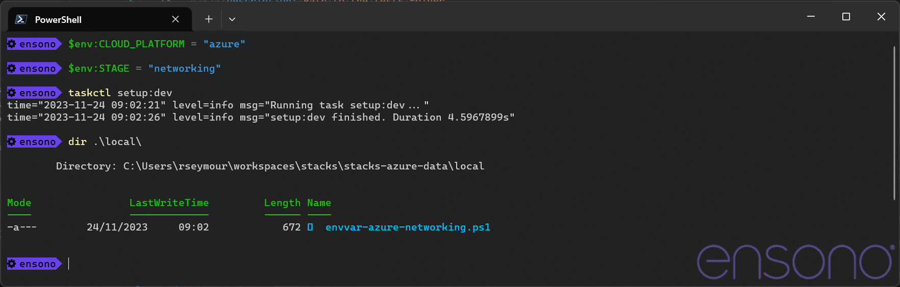

== Infrastructure Deployment

The infrastructure for this project is deployed using the Ensono Independent Runner (EIR), this means that the same commands can be run locally as would be run in the formal CI/CD pipeline.

The Terraform templates in this repository create any required networks as well as the components for a data environment. The network is intended to be run once and the environment components run numerous times to connect to the deployed network.

=== Deployment from local workstation

==== Tools

In order to use EIR locally two tools are required.

* Taskctl - https://github.com/Ensono/taskctl/releases/tag/v1.5.0
** Please ensure you download this version of Taskctl as it is has support for generating the environment file required for the container
* Container Engine (any one of the following will work)
** Docker Desktop - https://www.docker.com/products/docker-desktop/
** Rancher Desktop - https://rancherdesktop.io/
** Podman - https://podman.io/

With these tools installed all of the tasks in EIR can be run locally.

==== Setup

There are a number of variables that need to be configured in order to deploy any of the terraform templates. To make this easier EIR contains a task that will create a shell script (PowerShell or Bash, depending on what is being run) that will configure th required environment variables. Once this file has been generated it must be edited to suit the environment.

When the script file has been updated, run it and then subsequent tasks can be executed. All of the environment variables in the current shell will be copied into the execution environment.

[source,powershell,linenums]
----
# Create a script to setup the environment variables for networking infrastructure
mkdir local # This directory is ignored by Git
$env:STAGE = "networking"
taskctl setup:dev
----

.Create script to configure environment variables

Once the file has been created, it needs to be edited with the relevant values. The following shows example values in the file.

[source,powershell,options=linenums]
----
# Cloud that is being targeted, e.g. aws or azure
$env:CLOUD_PLATFORM="azure"

# Path to the Terraform template files, from the perspective of the executing container
$env:TF_FILE_LOCATION="/app/deploy/azure/networking"

# State if the infrastructure should be deployed using private networks
$env:TF_VAR_enable_private_network="false"

# Environment that things are being deployed to
$env:TF_VAR_core_environment="nonprod"

# Component that is being deployed
$env:TF_VAR_component="de"

# Location of the resource group in Azure
$env:TF_VAR_resource_group_location="westeurope"

# Name of the company for which this infrastructure is being built
$env:TF_VAR_name_company="ensono"

# Name of the project
$env:TF_VAR_name_project="salesdata"

# Area / domain that this project relates to
$env:TF_VAR_name_domain="core-data"

# Stage within the specified Terraform files that is being deployed.
$env:TF_VAR_stage="dev"

# Name of the user to log into SQL with
$env:TF_VAR_sql_admin_login="mssqladmin"

# IP address of the build agent which needs access to the platform. This is only required when using a private network
$env:TF_VAR_build_agent_ip=""

# Arguments that should be passed to Terraform during the init process
$env:TF_BACKEND_INIT = "key=$($env:tf_state_key),storage_account_name=amidostackstfstate,resource_group_name=$($env:TF_STATE_RG),container_name=$($env:TF_STATE_CONTAINER),subscription_id=$($env:arm_subscription_id),tenant_id=$($env:arm_tenant_id),client_id=$($env:arm_client_id),client_secret=$($env:arm_client_secret)"
----

After editing the file needs to be executed so that the variables are set in the environment before the tasks are excecuted. In addition to the variables in the file, the following credential variables need to be set for the specified cloud.

* Azure
** ARM_CLIENT_ID
** ARM_CLIENT_SECRET
** ARM_SUBSCRITPION_ID
** ARM_TENANT_ID
* AWS
** AWS_ACCESS_KEY_ID
** AWS_SECRET_ACCESS_KEY
** AWS_REGION

[source,powershell,linenums]
----
# Set the credential environment variables
# The values set here are dummy values and do not provide access to Azure
$env:ARM_CLIENT_ID = "d819a784-70ca-4eb2-bce2-ffbd7035fb6a"
$env:ARM_CLIENT_SECRET = "gPGKp3LUN1QnhSY5lakiAeMZjsO7XxWD"
$env:ARM_SUBSCRIPTION_ID = "9c2c9cee-3f32-40b0-926a-87ebaefcadae"
$env:ARM_TENANT_ID = "d0f9915f-7774-4679-b47d-f456d8583e24"

# Execute environment variable script
local/env--networking.ps1

# Run the task to initialise the chosen terraform templates
taskctl infra:init
----