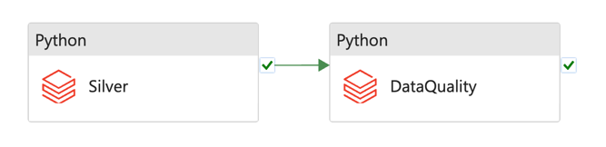

# Data Quality

[stacks-azure-data](https://github.com/amido/stacks-azure-data) ETL pipelines in Azure Data Factory
can be deployed with an extra step, 'Data Quality', which validates that the outputs of the pipeline
meet the specified requirements. You can express these requirements in a simple, human-readable
language. It allows you to assert certain expectations about your data, which can help catch any
discrepancies, anomalies, or errors in your data as early in the pipeline as possible.

Data Quality checks are executed as Python Databricks jobs with the quality validation logic
packaged within our [PySparkle](../../../../common/data/pysparkle/pysparkle_data_quality.md) library.
Internally, PySparkle leverages the capabilities of the [Great Expectations](https://greatexpectations.io/)
library, an open-source Python-based library, to perform these checks.

The design of the Data Quality processing is outlined in the following diagram.

## ADF Pipelines with DQ

### Ingest

### Silver

