This section provides an overview of deploying microsoft fabric through Azure portal for Ensono Stacks Data Platform.

## Step 1: Create fabric capacity resource

1. Login to azure portal, search for Fabric and select Create.

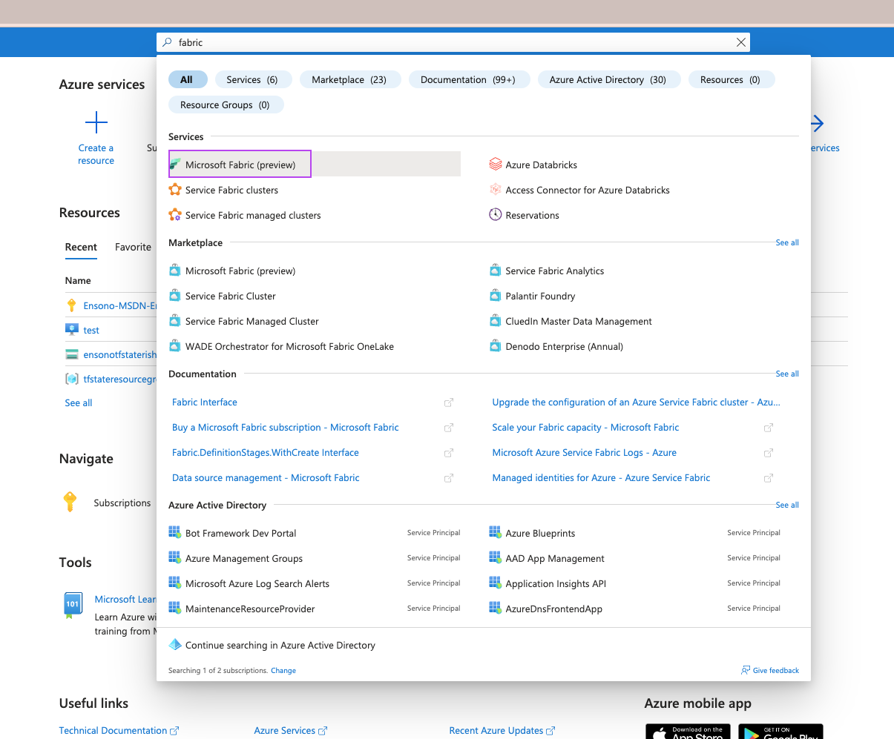

2. Create a fabric resource.
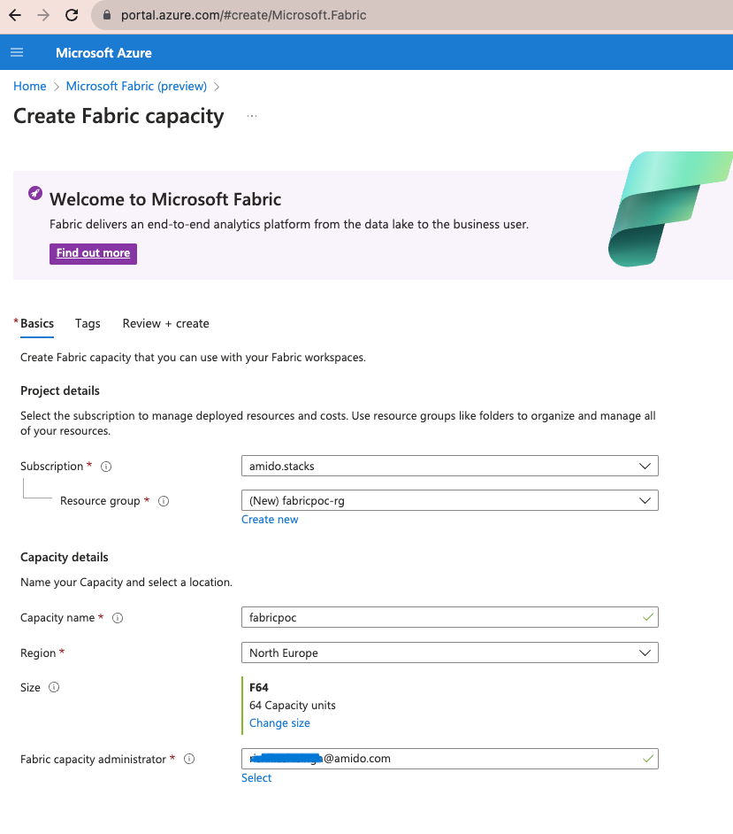
   1. Select the subscription for the new fabric capacity.
   2. Create a new resource group for this fabric capacity, or select an existing one.
   3. Enter the name used to identify this resource and is displayed in the Microsoft Fabric admin portal and Azure portal. The name must be unique in the selected location. Only lowercase letters and numbers may be used.
   4. Enter the region.
   5. Select the resource size that best meets your needs.
   6. Microsoft Fabric capacity administrator will manage the capacity. The capacity administrator must be a member user or a service principal in your AAD tenant.

## Step 2: Create a Microsoft Fabric Workspace

Workspaces are places to collaborate with colleagues to create collections of items such as lakehouses, warehouses, and reports.

1. Sign-in to your organization's PowerBI portal at https://app.powerbi.com. you would need to ask your IT admin to grant a PowerBI pro license and workspace admin rights on your account to create workspaces.

2. Select workspaces from left plane and choose new workspace from bottom.
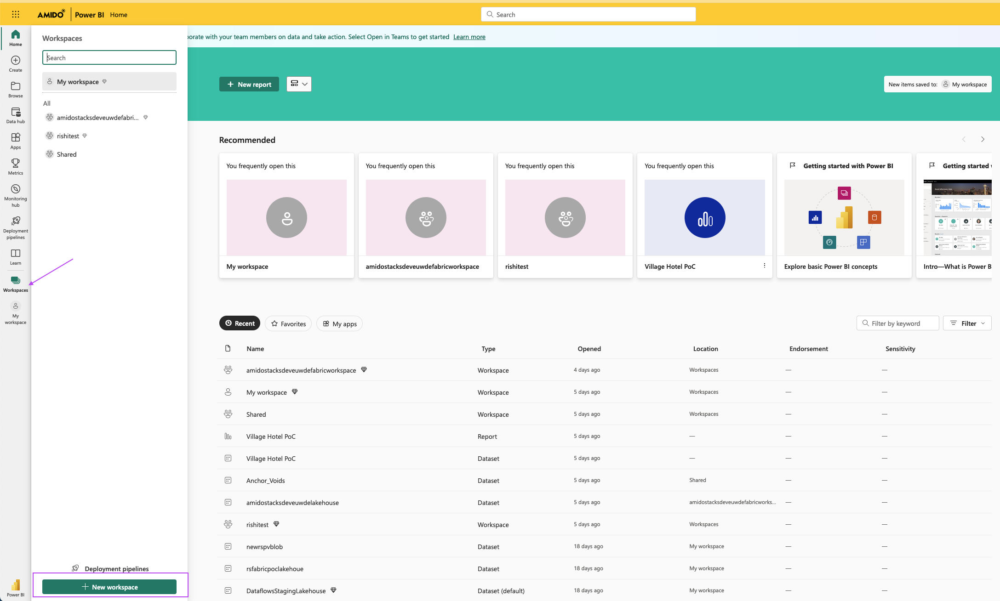

3. Enter the name of workspace and under advanced options choose "fabric" for license mode and scroll down for step 4.
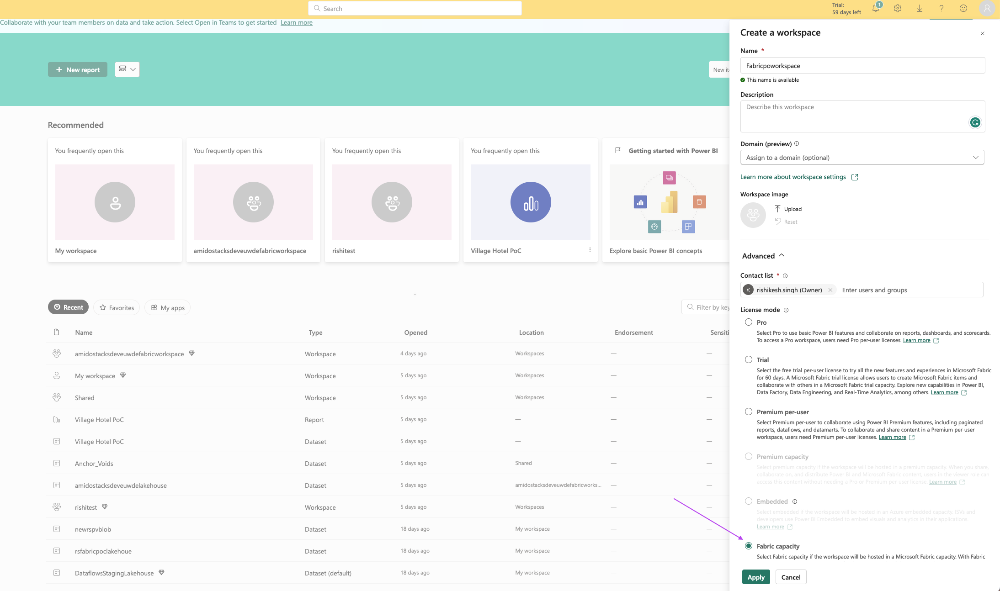

4. Choose the Azure fabric capacity resource created at ## Step 1 and hit "Apply".
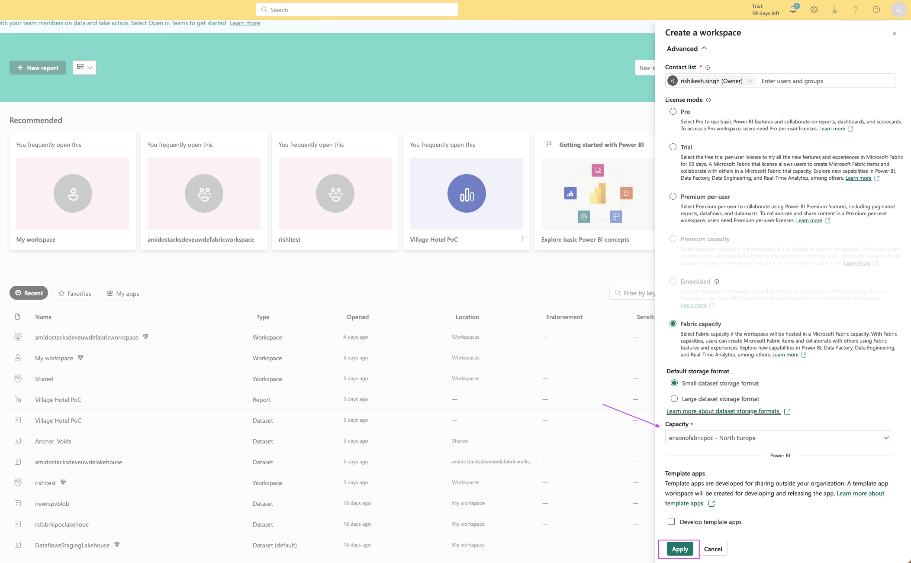

5. Select newly created workspace from left workspaces panel.
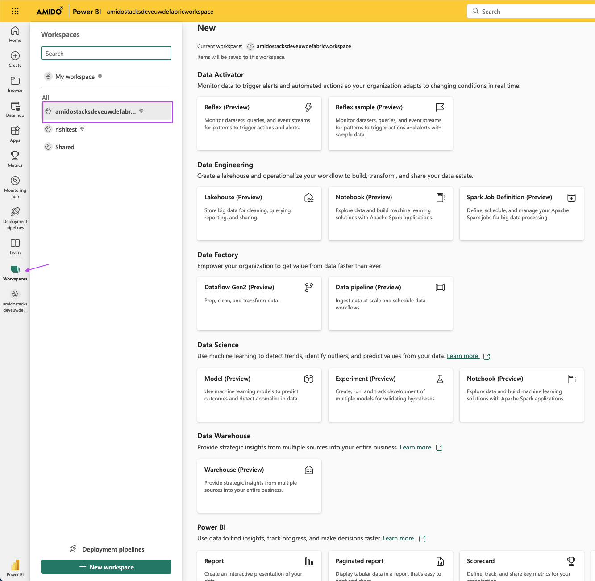

6. From header menu choose New and select "more options"
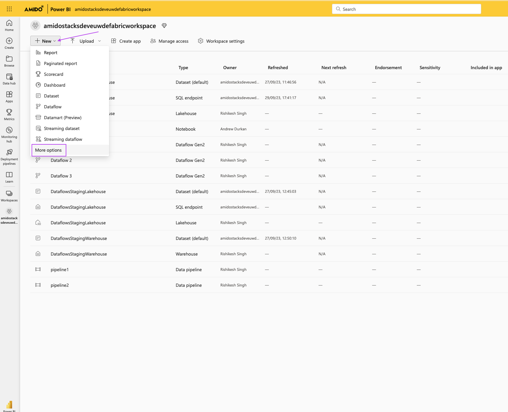

7. Choose Lakehouse, and provide Name.
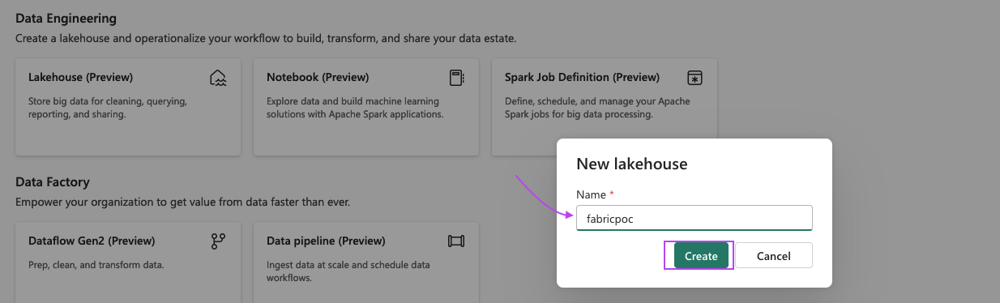

8. Right click on files option on left side plane and choose "New shortcut".
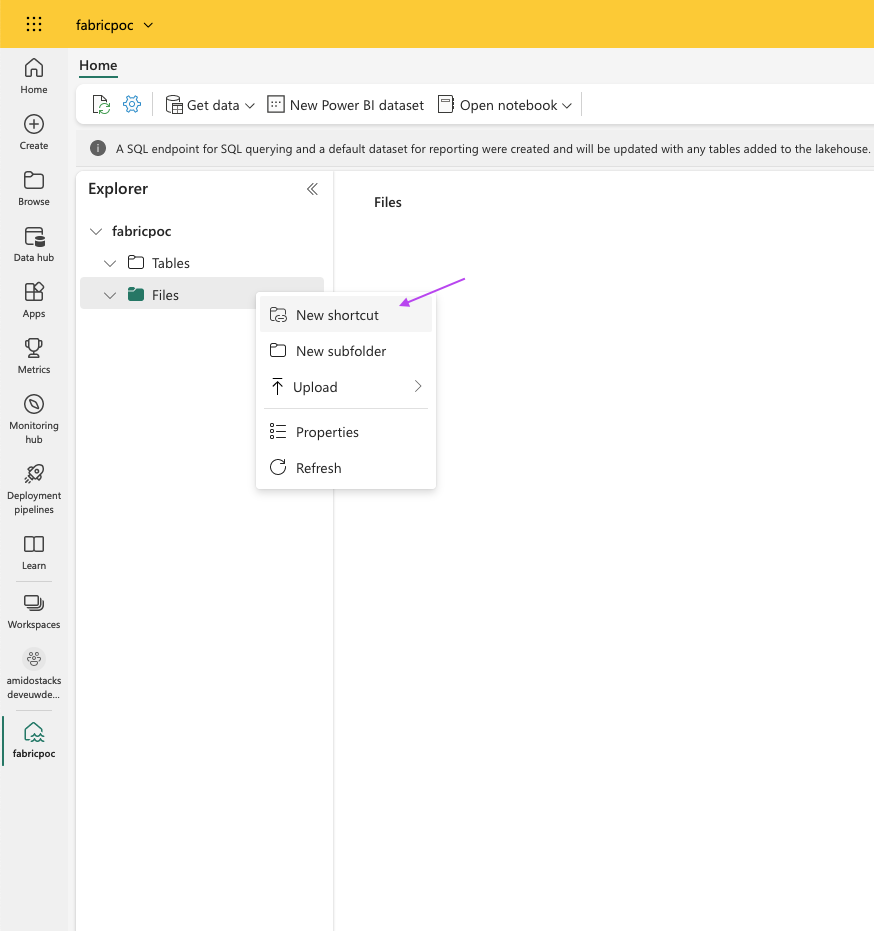

9. Under "External sources" select "Azure Data Lake Storage Gen2".
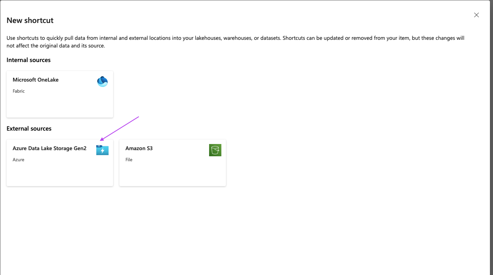

10. Provide connection details for your ADLS storage account and hit "Next".
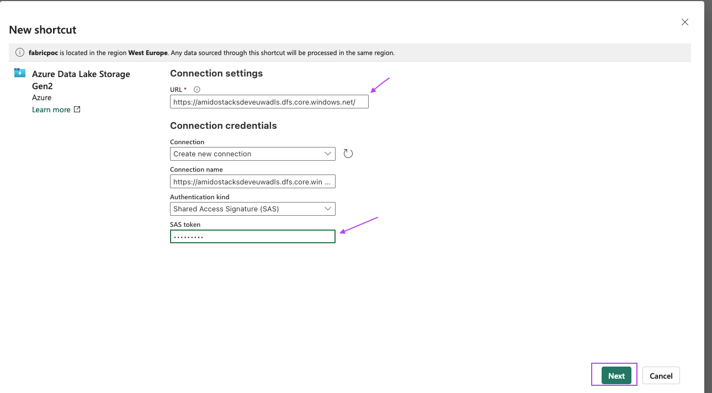
  1. URL: the url for ADLS gen2 endpoint to connect.
  2. connection ( leave blank)
  3. connection name ( can be left as is)
  4. Authentication type, can very depending on organization's need, SAS token is advised.

## Step 3: TO be ADDED by DE
